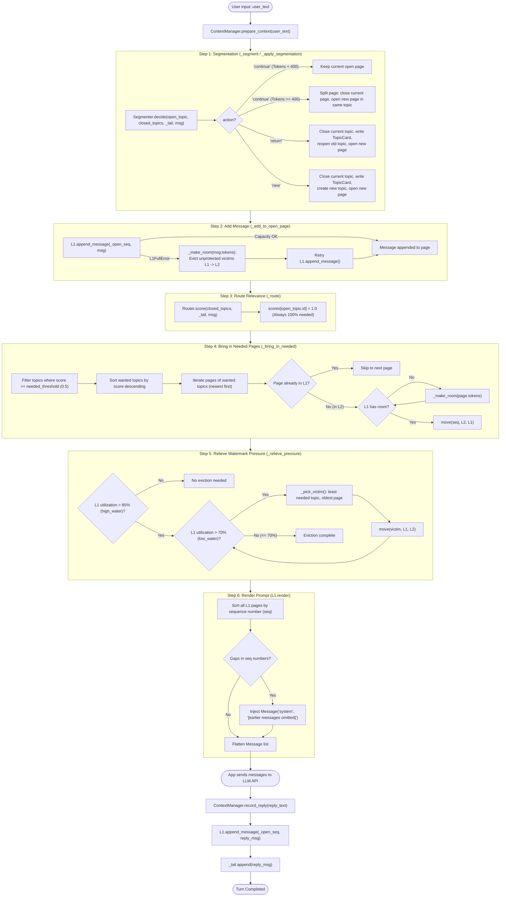
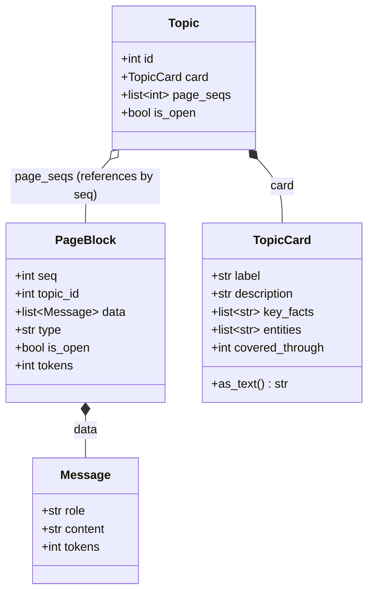
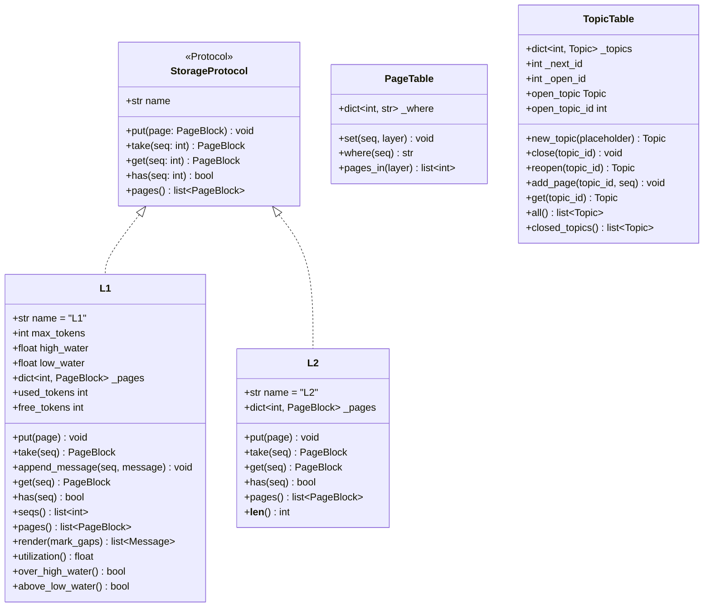
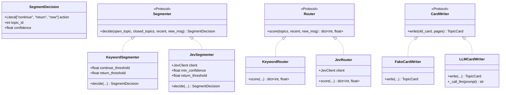
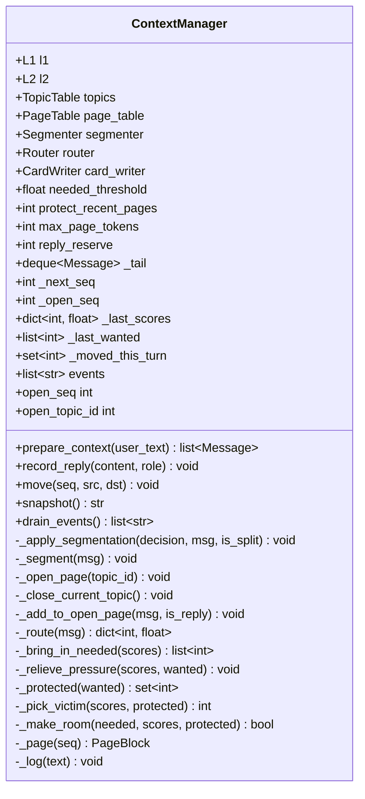

This fie contains all the necessary information for understanding and implementing the PRISM architecture.

# PRISM System Architecture & Class Reference Manual

> **PRISM**: *Page-based Reduced-context In-memory Storage Manager*  
> Inspired by Operating System Virtual Memory Paging and Cognitive Psychology Dual-Process Theory (System 1 fast heuristics + System 2 deep reasoning).

---

## Table of Contents
1. [Architectural Overview & Core Invariants](#1-architectural-overview--core-invariants)
2. [End-to-End Turn Pipeline Flow](#2-end-to-end-turn-pipeline-flow)
3. [Core Data Models (`prism.models`)](#3-core-data-models-prismmodels)
   - [Message](#message)
   - [PageBlock](#pageblock)
   - [TopicCard](#topiccard)
   - [Topic](#topic)
4. [Storage Subsystem (`prism.storage`)](#4-storage-subsystem-prismstorage)
   - [StorageProtocol](#storageprotocol)
   - [L1FullError](#l1fullerror)
   - [L1 (Level 1 Active Working Memory)](#l1-level-1-active-working-memory)
   - [L2 (Level 2 Archival Memory)](#l2-level-2-archival-memory)
   - [PageTable (LocationBook)](#pagetable-locationbook)
   - [TopicTable](#topictable)
5. [Cognitive Deciders Subsystem (`prism.deciders`)](#5-cognitive-deciders-subsystem-prismdeciders)
   - [SegmentDecision & Segmenter Protocol](#segmentdecision--segmenter-protocol)
   - [KeywordSegmenter & JevSegmenter](#keywordsegmenter--jevsegmenter)
   - [Router Protocol, KeywordRouter & JevRouter](#router-protocol-keywordrouter--jevrouter)
   - [CardWriter Protocol, FakeCardWriter & LLMCardWriter](#cardwriter-protocol-fakecardwriter--llmcardwriter)
6. [Orchestrator: ContextManager (`prism.context_manager`)](#6-orchestrator-contextmanager-prismcontext_manager)
   - [Class Responsibilities & State Attributes](#class-responsibilities--state-attributes)
   - [Public API Methods](#public-api-methods)
   - [Turn Pipeline Step Methods](#turn-pipeline-step-methods)
   - [Memory Eviction & Protection Helpers](#memory-eviction--protection-helpers)
7. [Detailed Step-by-Step Execution Scenarios](#7-detailed-step-by-step-execution-scenarios)
   - [Scenario A: L1 Overflow & Automatic Room Recovery (`_make_room`)](#scenario-a-l1-overflow--automatic-room-recovery-_make_room)
   - [Scenario B: Topic Switching, Card Synthesis & Page Sealing](#scenario-b-topic-switching-card-synthesis--page-sealing)
   - [Scenario C: Intelligent Cache Warmup from L2 (`_bring_in_needed`)](#scenario-c-intelligent-cache-warmup-from-l2-_bring_in_needed)
   - [Scenario D: High-Water Hysteresis Eviction (`_relieve_pressure`)](#scenario-d-high-water-hysteresis-eviction-_relieve_pressure)
   - [Scenario E: Non-Contiguous Page Rendering with System Gap Markers](#scenario-e-non-contiguous-page-rendering-with-system-gap-markers)
8. [Comprehensive Class, Method & Attribute Reference Matrix](#8-comprehensive-class-method--attribute-reference-matrix)

---

## 1. Architectural Overview & Core Invariants

PRISM manages LLM prompt context the same way modern Operating Systems manage physical RAM using **virtual memory paging**:

```
+------------------------------------------------------------------------------------+
|                                 APPLICATION LAYER                                   |
|               prepare_context(user_text)  --->  record_reply(reply_text)           |
+------------------------------------------+-----------------------------------------+
                                           |
                                           v
+------------------------------------------------------------------------------------+
|                         ORCHESTRATOR: ContextManager                               |
|   Coordinates segmentation, routing, memory limits, and atomic layer transfers     |
+---------------------+-------------------------------+------------------------------+
                      |                               |
     DECIDERS (Fast System 1)           STORAGE SUBSYSTEM (OS Memory Model)
   +---------------------------+       +---------------------------------------------+
   | - Segmenter (Switch/Cont) |       | [L1]: Active RAM (Token Capped prompt)      |
   | - Router    (Relevance)   | <---> | [L2]: Swap Disk (Uncapped word-for-word)    |
   | - CardWriter(Topic Index) |       | [PageTable]: MMU Page Frame Directory       |
   +---------------------------+       | [TopicTable]: Process / Thread Group Table  |
                                       +---------------------------------------------+
```

### OS Virtual Memory Analogy

| OS Virtual Memory Concept | PRISM Counterpart | Description |
| :--- | :--- | :--- |
| **Physical RAM (Working Set)** | [`L1`](file:///d:/Projects/PRISM/files/prism/storage/l1.py#L11-L86) | The hard token-budgeted prompt memory sent to the LLM API. |
| **Swap Space / Disk Cache** | [`L2`](file:///d:/Projects/PRISM/files/prism/storage/l2.py#L7-L31) | Infinite capacity, in-memory verbatim storage for inactive conversation pages. |
| **MMU Page Table** | [`PageTable`](file:///d:/Projects/PRISM/files/prism/storage/page_table.py#L9-L25) | Single source of truth mapping each permanent sequence ID (`seq`) to `"L1"` or `"L2"`. |
| **Memory Page / Frame** | [`PageBlock`](file:///d:/Projects/PRISM/files/prism/models.py#L26-L37) | Discrete chunk of messages grouped chronologically by topic. |
| **Process / Thread Group** | [`Topic`](file:///d:/Projects/PRISM/files/prism/models.py#L53-L59) | A logical conversation thread that owns an ordered list of `PageBlock` sequence IDs. |
| **TLB / Page Index Descriptor** | [`TopicCard`](file:///d:/Projects/PRISM/files/prism/models.py#L39-L51) | Compressed index summary (label, facts, entities) used by the Router. |
| **Page Eviction & Paging-In** | `ContextManager.move()` | Atomic transfer mechanism between `L1` and `L2`. |

### Core Architectural Invariants

1. **Single-Open-Topic Invariant**:  
   At any moment in time, exactly zero or one [`Topic`](file:///d:/Projects/PRISM/files/prism/models.py#L53-L59) can have `is_open = True`. Before starting a new topic or reopening a previous one, the currently open topic must be sealed and its [`TopicCard`](file:///d:/Projects/PRISM/files/prism/models.py#L39-L51) updated.
2. **Open Page Inviolability**:  
   The currently active page receiving messages (`_open_seq`) is always open (`is_open = True`) and reside in [`L1`](file:///d:/Projects/PRISM/files/prism/storage/l1.py#L11-L86). It is **illegal** to evict or `take()` an open page out of L1.
3. **Hard Token Budgeting & Watermark Hysteresis**:  
   `L1` enforces a strict maximum token capacity (`max_tokens`). To prevent cache thrashing (continuous rapid page eviction and reload), evictions are governed by a hysteresis loop:
   - Eviction triggers only when `utilization > high_water` (default `85%`).
   - Eviction demotes pages until `utilization <= low_water` (default `70%`).
4. **Permanent Sequence Monotonicity & Gap Integrity**:  
   Every [`PageBlock`](file:///d:/Projects/PRISM/files/prism/models.py#L26-L37) receives an auto-incrementing, immutable sequence integer (`seq`). In `L1.render()`, if any sequence numbers are missing between rendered pages, a system marker `[earlier messages omitted]` is injected so the LLM remains aware of context omissions.
5. **Mutual Layer Residency**:  
   A page exists in exactly one storage layer at any instant. The [`PageTable`](file:///d:/Projects/PRISM/files/prism/storage/page_table.py#L9-L25) is updated synchronously whenever [`move()`](file:///d:/Projects/PRISM/files/prism/context_manager.py#L138-L149) executes.
6. **No-Thrash Single-Turn Guarantee**:  
   Any page moved into `L1` or demoted during the current turn is recorded in `_moved_this_turn` and excluded from further eviction during the same turn.

---

## 2. End-to-End Turn Pipeline Flow

Every conversational interaction passes through two entry points in [`ContextManager`](file:///d:/Projects/PRISM/files/prism/context_manager.py#L19-L331):
- `prepare_context(user_text)`: The 6-step ingestion, decision, memory paging, and prompt generation pipeline.
- `record_reply(reply_text)`: Appends the LLM assistant response to the current open page.



---

## 3. Core Data Models (`prism.models`)

The file [`prism/models.py`](file:///d:/Projects/PRISM/files/prism/models.py) represents the root of the data architecture. It imports no external dependencies to prevent cyclic coupling.



---

### `Message`
Defined in [`prism/models.py:L17-L24`](file:///d:/Projects/PRISM/files/prism/models.py#L17-L24). Represents an atomic conversational utterance or system directive.

#### Attributes & Properties
- `role` (`str`): The participant identifier. Permitted values:
  - `"user"`: Direct human user query.
  - `"assistant"`: Response produced by the language model.
  - `"tool"`: Tool/function execution result.
  - `"system"`: Reserved exclusively for internal framework directives (specifically gap markers).
- `content` (`str`): The verbatim textual body of the message.
- `tokens` (`int`, Property): Dynamically calculated estimate of token weight via `estimate_tokens(self.content)`. Uses the standard heuristic `max(1, len(text) // 4)`.

#### Method Walkthrough & Scenario
```python
# Helper function in prism.models
def estimate_tokens(text: str) -> int:
    return max(1, len(text) // 4)
```
- **Execution Scenario**:  
  A user submits `"Help me fix auth.py, token is expired"`.
  - Content length = 38 characters.
  - `tokens` property returns `max(1, 38 // 4) = 9` tokens.
  - *Result*: The `Message` instance registers a token footprint of 9. When added to a [`PageBlock`](file:///d:/Projects/PRISM/files/prism/models.py#L26-L37), it increments both the page's and `L1`'s consumed token counters by 9.

---

### `PageBlock`
Defined in [`prism/models.py:L27-L37`](file:///d:/Projects/PRISM/files/prism/models.py#L27-L37). The fundamental unit of memory allocation and transfer in PRISM.

#### Attributes & Properties
- `seq` (`int`): The permanent, globally unique sequence index (0-indexed). Assigned monotonically by `ContextManager._next_seq`.
- `topic_id` (`int`): Foreign key identifying the parent [`Topic`](file:///d:/Projects/PRISM/files/prism/models.py#L53-L59) this page belongs to.
- `data` (`list[Message]`): The chronological list of messages stored within this page frame.
- `type` (`str`, Default: `"chat"`): Structural type of the page. Extensible to `"summary"` or `"file_stub"` in future tiers.
- `is_open` (`bool`, Default: `True`): Flag indicating if the page can still receive new messages. When `True`, the page cannot be evicted from `L1`.
- `tokens` (`int`, Property): Computes `sum(m.tokens for m in self.data)`. Represents the real-time token footprint of the block.

#### Method Walkthrough & Scenario
- **Method**: `tokens`
- **Execution Scenario**:  
  Page `seq=0` contains 2 messages:
  1. `Message("user", "Hello world")` -> 2 tokens.
  2. `Message("assistant", "Hello! How can I assist you today?")` -> 9 tokens.
  - `page.tokens` evaluates to `11`.
  - When `ContextManager.prepare_context()` evaluates whether the page exceeds `max_page_tokens` (e.g., 400), it queries `page.tokens`. If `page.tokens >= 400`, `is_split` is marked `True`, sealing this page (`is_open = False`) and triggering the opening of a fresh `PageBlock(seq=1, topic_id=topic.id)`.

---

### `TopicCard`
Defined in [`prism/models.py:L40-L51`](file:///d:/Projects/PRISM/files/prism/models.py#L40-L51). An index card summarizing an entire topic. This is the **only** representation of inactive topics seen by the [`Router`](file:///d:/Projects/PRISM/files/prism/deciders/interfaces.py#L28-L37).

#### Attributes & Properties
- `label` (`str`): Short title (up to 8 words) summarizing the theme (e.g. `"Authentication / Token Expiry"`).
- `description` (`str`, Default: `""`): Concise 2–3 sentence overview of what was discussed and the conclusion reached.
- `key_facts` (`list[str]`, Default: `[]`): Concrete extracted facts (e.g. `["auth.py handles JWT", "refresh token lifetime is 3600s"]`).
- `entities` (`list[str]`, Default: `[]`): Key named items (e.g. `["auth.py", "JWT", "Redis"]`).
- `covered_through` (`int`, Default: `-1`): The highest `PageBlock.seq` summarized by this card. Prevents re-summarizing old pages during incremental updates.

#### Method Walkthrough: `as_text()`
```python
def as_text(self) -> str:
    parts = [self.label, self.description, *self.key_facts, *self.entities]
    return " | ".join(p for p in parts if p)
```
- **Execution Scenario**:  
  Topic 1 was about travel planning:
  - `label` = `"Kerala Backwaters"`
  - `description` = `"Planned trip in December."`
  - `key_facts` = `["User traveling in Dec"]`
  - `entities` = `["Kerala", "Alappuzha"]`
  - Calling `card.as_text()` yields:  
    `"Kerala Backwaters | Planned trip in December. | User traveling in Dec | Kerala | Alappuzha"`
  - *Outcome*: This condensed string is passed to `KeywordRouter` or `JevRouter` to calculate cosine or lexical similarity against a new incoming user query without loading the raw conversational transcripts into memory.

---

### `Topic`
Defined in [`prism/models.py:L54-L59`](file:///d:/Projects/PRISM/files/prism/models.py#L54-L59). The container grouping related `PageBlock` sequences under a common identity.

#### Attributes & Properties
- `id` (`int`): Unique auto-incrementing integer topic identifier (`1, 2, ...`).
- `card` (`TopicCard`): The topic's metadata descriptor card.
- `page_seqs` (`list[int]`): List of all sequence IDs owned by this topic. Note: These page sequence numbers are monotonically increasing, but **not necessarily contiguous** if the user interleaved other topics in between!
- `is_open` (`bool`, Default: `True`): Indicates whether this topic is currently active.

---

## 4. Storage Subsystem (`prism.storage`)

The storage package implements the multi-tier memory hierarchy.



---

### `StorageProtocol`
Defined in [`prism/storage/base.py:L9-L31`](file:///d:/Projects/PRISM/files/prism/storage/base.py#L9-L31). A typing protocol guaranteeing interchangeability between storage tiers (`L1`, `L2`, and future `L3` vector stores or `L4` cold disk storage).

#### Interface Methods
- `put(page: PageBlock) -> None`: Inserts a page into the layer.
- `take(seq: int) -> PageBlock`: Removes and returns the page identified by `seq`.
- `get(seq: int) -> PageBlock`: Retrieves the page reference without removing it.
- `has(seq: int) -> bool`: Checks if sequence number `seq` exists in this layer.
- `pages() -> list[PageBlock]`: Returns all pages stored in the layer sorted ascending by `seq`.

---

### `L1FullError`
Defined in [`prism/storage/l1.py:L7-L9`](file:///d:/Projects/PRISM/files/prism/storage/l1.py#L7-L9).  
Raised by [`L1.put()`](file:///d:/Projects/PRISM/files/prism/storage/l1.py#L23-L28) or [`L1.append_message()`](file:///d:/Projects/PRISM/files/prism/storage/l1.py#L37-L40) when an insertion would cause `used_tokens > max_tokens`. Signals to the [`ContextManager`](file:///d:/Projects/PRISM/files/prism/context_manager.py#L19-L331) that it must evict pages to `L2` via `_make_room()`.

---

### `L1` (Level 1 Active Working Memory)
Defined in [`prism/storage/l1.py:L11-L86`](file:///d:/Projects/PRISM/files/prism/storage/l1.py#L11-L86).  
Represents the working set prompt cache directly submitted to the LLM.

#### Attributes & Initialization
```python
def __init__(self, max_tokens: int, high_water: float = 0.85, low_water: float = 0.70):
```
- `max_tokens` (`int`): Absolute ceiling on tokens stored in `L1`.
- `high_water` (`float`, Default: `0.85`): Threshold ratio above which eviction is triggered (85% of `max_tokens`).
- `low_water` (`float`, Default: `0.70`): Target ratio down to which eviction continues once started (70% of `max_tokens`).
- `_pages` (`dict[int, PageBlock]`): Internal hash map mapping `seq -> PageBlock`.

#### Properties
- `used_tokens` (`int`): Sum of all tokens in stored pages (`sum(p.tokens for p in self._pages.values())`).
- `free_tokens` (`int`): Remaining capacity (`self.max_tokens - self.used_tokens`).

#### Methods & Scenarios

##### `put(page: PageBlock) -> None`
Stores a new page in `L1`.
- **Preconditions**: `page.seq not in self._pages` and `page.tokens <= self.free_tokens`.
- **Exceptions**: Raises `ValueError` on duplicate `seq`; raises `L1FullError` if insufficient free tokens.
- **Scenario**:  
  `max_tokens = 100`, `used_tokens = 80` (20 tokens free). A new empty page `PageBlock(seq=1, topic_id=2)` (0 tokens) is passed to `l1.put(page)`.  
  *Result*: Page is accepted and registered into `self._pages[1]`.

##### `take(seq: int) -> PageBlock`
Extracts and removes a page from `L1`.
- **Preconditions**: `page.is_open == False`.
- **Exceptions**: Raises `ValueError(f"page {seq} is open and cannot leave L1")`.
- **Scenario**:  
  During memory pressure relief, the eviction algorithm chooses page `seq=0` (closed, 40 tokens). Calling `l1.take(0)` deletes `seq=0` from `self._pages` and returns it. `L1.used_tokens` instantly drops by 40. However, if code erroneously attempts `l1.take(_open_seq)`, it raises `ValueError`, strictly enforcing the Open Page Inviolability invariant.

##### `append_message(seq: int, message: Message) -> None`
Appends a message directly to an existing page in `L1`.
- **Preconditions**: `message.tokens <= self.free_tokens`.
- **Exceptions**: Raises `L1FullError` if the message cannot fit into remaining free tokens.
- **Scenario**:  
  Page `seq=2` has 30 tokens; `L1` has `max_tokens = 100` and `used_tokens = 95` (5 free tokens). A user sends a 15-token message.  
  `l1.append_message(2, msg)` checks `15 > 5` and immediately raises `L1FullError`.  
  *Handling*: `ContextManager` catches this, identifies an eviction candidate, moves the candidate to `L2` to free at least 15 tokens, and retries `append_message`.

##### `render(mark_gaps: bool = True) -> list[Message]`
Flattens all pages currently in `L1` into a continuous list of messages formatted for the LLM prompt.
- **Internal Logic**:  
  1. Retrieves pages sorted ascending by `seq`.
  2. If the first page is not `seq=0`, prepends `Message("system", "[earlier messages omitted]")`.
  3. If there is a discontinuity (`page.seq != expected_seq`), inserts `Message("system", "[earlier messages omitted]")`.
  4. Concatenates `page.data` messages.
- **Scenario**:  
  `L1` contains pages `seq=0` and `seq=3` (pages 1 and 2 were evicted to L2).  
  Calling `l1.render()` produces:
  `[Page 0 Message 1, Page 0 Message 2, Message("system", "[earlier messages omitted]"), Page 3 Message 1]`.

##### Accounting Methods
- `utilization() -> float`: Returns `used_tokens / max_tokens`.
- `over_high_water() -> bool`: Returns `True` if `utilization() > high_water` (e.g. `> 0.85`).
- `above_low_water() -> bool`: Returns `True` if `utilization() > low_water` (e.g. `> 0.70`).

---

### `L2` (Level 2 Archival Memory)
Defined in [`prism/storage/l2.py:L7-L31`](file:///d:/Projects/PRISM/files/prism/storage/l2.py#L7-L31).  
An in-memory holding area for pages that were evicted from `L1`. It has no token capacity limit.

#### Methods
- `put(page: PageBlock) -> None`: Stores the page in `self._pages[page.seq]`.
- `take(seq: int) -> PageBlock`: Pops and returns `self._pages.pop(seq)`.
- `get(seq: int) -> PageBlock`: Returns `self._pages[seq]`.
- `has(seq: int) -> bool`: Returns `seq in self._pages`.
- `pages() -> list[PageBlock]`: Returns all held pages sorted ascending by `seq`.
- `__len__() -> int`: Number of pages currently archived.

---

### `PageTable` (LocationBook)
Defined in [`prism/storage/page_table.py:L9-L25`](file:///d:/Projects/PRISM/files/prism/storage/page_table.py#L9-L25).  
Acts as the Memory Management Unit (MMU) tracking the exact layer residency of every page in the system.

#### Attributes
- `_where` (`dict[int, str]`): Maps `seq` -> `"L1"` or `"L2"`.

#### Methods & Scenarios
- `set(seq: int, layer: str) -> None`: Updates the location of page `seq`.
- `where(seq: int) -> str`: Returns the layer name (`"L1"` or `"L2"`).
- `pages_in(layer: str) -> list[int]`: Returns a sorted list of all page sequence IDs residing in that layer.
- **Scenario**:  
  Page `seq=1` is moved from `L1` to `L2` via `ContextManager.move(1, l1, l2)`.  
  Inside `move()`, `self.page_table.set(1, "L2")` is called. Subsequent calls to `page_table.where(1)` return `"L2"`, and `page_table.pages_in("L1")` no longer includes `1`.

---

### `TopicTable`
Defined in [`prism/storage/topic_table.py:L7-L55`](file:///d:/Projects/PRISM/files/prism/storage/topic_table.py#L7-L55).  
Manages the lifecycle of conversation topics and enforces the Single-Open-Topic invariant.

#### Attributes & Properties
- `_topics` (`dict[int, Topic]`): Maps `topic_id -> Topic`.
- `_next_id` (`int`, Default: `1`): Monotonic ID generator for topics.
- `_open_id` (`int | None`, Default: `None`): The ID of the currently active open topic, or `None`.
- `open_topic` (`Topic | None`, Property): Returns the currently open `Topic` object, or `None`.
- `open_topic_id` (`int | None`, Property): Returns `_open_id`.

#### Methods & Scenarios

##### `new_topic(placeholder: str) -> Topic`
Creates, registers, and activates a new topic with a temporary label.
- **Invariant Check**: Raises `RuntimeError("close the open topic before starting a new one")` if `_open_id is not None`.
- **Scenario**:  
  At system startup, `_open_id` is `None`. User starts talking about python debugging.  
  `new_topic("Help me debug the login bug in auth.py")` creates `Topic(id=1, card=TopicCard(label="Help me debug the login bug in auth.py"))`, sets `_open_id = 1`, and returns the topic.

##### `close(topic_id: int) -> None`
Marks the specified topic as closed (`topic.is_open = False`). If `_open_id == topic_id`, resets `_open_id = None`.
- **Scenario**:  
  User pivots to a new topic. `close(1)` closes Topic 1, clearing `_open_id` so that `new_topic()` or `reopen()` can proceed safely.

##### `reopen(topic_id: int) -> Topic`
Re-activates a previously closed topic.
- **Invariant Check**: Raises `RuntimeError("close the open topic before reopening another")` if `_open_id is not None`.
- **Scenario**:  
  User returns to Topic 1 after discussing Topic 2. Topic 2 is closed first (`close(2)`). Then `reopen(1)` sets `Topic 1.is_open = True`, sets `_open_id = 1`, and returns Topic 1.

##### Other Methods
- `add_page(topic_id: int, seq: int) -> None`: Appends page sequence `seq` to `topic.page_seqs`.
- `get(topic_id: int) -> Topic`: Looks up a topic by ID.
- `all() -> list[Topic]`: Returns all topics created.
- `closed_topics() -> list[Topic]`: Returns a list of topics where `is_open == False`.

---

## 5. Cognitive Deciders Subsystem (`prism.deciders`)

Deciders represent the System 1 fast heuristics. They inspect lightweight metadata (`TopicCard` text and recent message history) rather than loading complete conversation logs.



---

### `SegmentDecision` & `Segmenter` Protocol
Defined in [`prism/deciders/interfaces.py:L10-L26`](file:///d:/Projects/PRISM/files/prism/deciders/interfaces.py#L10-L26).

#### `SegmentDecision` Attributes
- `action` (`Literal["continue", "return", "new"]`):
  - `"continue"`: The new message belongs to the current open topic.
  - `"return"`: The message references an older, closed topic.
  - `"new"`: The message begins an entirely unrelated conversation thread.
- `topic_id` (`int | None`, Default: `None`): Populated with the target topic ID if `action == "return"`.
- `confidence` (`float`, Default: `1.0`): Confidence score of the decision (0.0 to 1.0).

#### `Segmenter` Protocol Signature
```python
class Segmenter(Protocol):
    def decide(
        self,
        open_topic: Topic | None,
        closed_topics: list[Topic],
        recent: list[Message],
        new_msg: Message,
    ) -> SegmentDecision: ...
```

---

### `KeywordSegmenter` & `JevSegmenter`

#### `KeywordSegmenter`
Defined in [`prism/deciders/fakes.py:L38-L72`](file:///d:/Projects/PRISM/files/prism/deciders/fakes.py#L38-L72). Fast, zero-dependency offline implementation based on vocabulary overlap:
1. Filters out English stopwords (e.g. `the`, `and`, `with`, `about`).
2. Computes the word overlap between `new_msg` and the current topic (`open_score`).
3. Computes the word overlap against each closed topic card (`s`).
4. If a closed topic scores `s >= return_threshold (0.34)` and `s > open_score`, emits `SegmentDecision("return", best_id, best_score)`.
5. If `open_score >= continue_threshold (0.2)` or `len(msg_words) <= 2` (short replies like "yes", "got it"), emits `SegmentDecision("continue")`.
6. Otherwise, emits `SegmentDecision("new")`.

#### `JevSegmenter`
Defined in [`prism/deciders/jev.py:L31-L76`](file:///d:/Projects/PRISM/files/prism/deciders/jev.py#L31-L76). Production implementation using TypeSafe AI's Jev API. Formulates a single fast `Choice` question with up to 255 options (`"continue"`, `"new"`, and `"return:<id>"` for each closed topic). If model confidence is below `min_confidence (0.6)`, it defaults safely to `"continue"`.

---

### `Router` Protocol, `KeywordRouter` & `JevRouter`
Defined in [`prism/deciders/interfaces.py:L28-L37`](file:///d:/Projects/PRISM/files/prism/deciders/interfaces.py#L28-L37).

#### `Router` Signature
```python
class Router(Protocol):
    def score(
        self,
        topics: list[Topic],
        recent: list[Message],
        new_msg: Message,
    ) -> dict[int, float]: ...
```
Returns a mapping of `{topic_id: probability_needed}` where probability is between `0.0` and `1.0`. Any topic scoring `>= needed_threshold` (default `0.5`) is deemed **wanted**, causing its pages to be pulled from `L2` into `L1`.

#### `KeywordRouter`
Defined in [`prism/deciders/fakes.py:L74-L83`](file:///d:/Projects/PRISM/files/prism/deciders/fakes.py#L74-L83).  
Computes `min(1.0, 2 * overlap(msg_words, words(topic.card.as_text())))`.

#### `JevRouter`
Defined in [`prism/deciders/jev.py:L78-L102`](file:///d:/Projects/PRISM/files/prism/deciders/jev.py#L78-L102).  
Constructs parallel `Noul` questions for each closed topic:  
`"The newest user message needs information from this earlier topic: <card text>"`  
Jev evaluates the truth probability directly in single-digit milliseconds.

---

### `CardWriter` Protocol, `FakeCardWriter` & `LLMCardWriter`
Defined in [`prism/deciders/interfaces.py:L39-L42`](file:///d:/Projects/PRISM/files/prism/deciders/interfaces.py#L39-L42).  
Called synchronously when a topic closes to synthesize or update its [`TopicCard`](file:///d:/Projects/PRISM/files/prism/models.py#L39-L51).

#### Interface Signature
```python
class CardWriter(Protocol):
    def write(self, old_card: TopicCard | None, pages: list[PageBlock]) -> TopicCard: ...
```

#### `FakeCardWriter`
Defined in [`prism/deciders/fakes.py:L85-L101`](file:///d:/Projects/PRISM/files/prism/deciders/fakes.py#L85-L101).  
Extracts top 6 most frequent non-stopwords as entities, records first 80 characters of user messages as key facts, and labels the card with the top 3 entities.

#### `LLMCardWriter`
Defined in [`prism/deciders/llm.py:L22-L42`](file:///d:/Projects/PRISM/files/prism/deciders/llm.py#L22-L42).  
Prompts a fast, small model (e.g. Claude 3.5 Haiku) with a strict JSON schema prompt to update labels, descriptions, concrete facts (replacing contradictory facts), and entities, keeping the summary under 150 tokens. Sets `covered_through = max(p.seq for p in pages)`.

---

## 6. Orchestrator: `ContextManager` (`prism.context_manager`)

Defined in [`prism/context_manager.py:L19-L331`](file:///d:/Projects/PRISM/files/prism/context_manager.py#L19-L331).  
The master controller that ties all components together.



---

### Class Responsibilities & State Attributes

#### Injected Dependencies
- `l1` ([`L1`](file:///d:/Projects/PRISM/files/prism/storage/l1.py#L11-L86)): Active prompt memory.
- `l2` ([`L2`](file:///d:/Projects/PRISM/files/prism/storage/l2.py#L7-L31)): Archival memory.
- `topics` ([`TopicTable`](file:///d:/Projects/PRISM/files/prism/storage/topic_table.py#L7-L55)): Topic tracking directory.
- `page_table` ([`PageTable`](file:///d:/Projects/PRISM/files/prism/storage/page_table.py#L9-L25)): MMU page frame directory.
- `segmenter` ([`Segmenter`](file:///d:/Projects/PRISM/files/prism/deciders/interfaces.py#L17-L26)): System 1 boundary detector.
- `router` ([`Router`](file:///d:/Projects/PRISM/files/prism/deciders/interfaces.py#L28-L37)): Relevance scorer for inactive topics.
- `card_writer` ([`CardWriter`](file:///d:/Projects/PRISM/files/prism/deciders/interfaces.py#L39-L42)): Synchronous topic card generator.

#### Configuration Tunables
- `needed_threshold` (`float`, Default: `0.5`): Minimum router probability to classify a closed topic as "wanted" and trigger bring-in.
- `protect_recent_pages` (`int`, Default: `2`): The newest `N` pages in `L1` are immune from eviction.
- `max_page_tokens` (`int`, Default: `400`): Threshold token count at which an open page is split into a new page block.
- `reply_reserve` (`int`, Default: `0`): Minimum free token headroom reserved in `L1` for the model's future reply.
- `recent_window` (`int`, Default: `4`): Capacity of `_tail` message buffer.

#### Internal State Tracking
- `_tail` (`deque[Message]`): Sliding window of the last `recent_window` messages passed to deciders.
- `_next_seq` (`int`, Initial: `0`): Monotonically increasing sequence generator for page blocks.
- `_open_seq` (`int | None`, Initial: `None`): Sequence ID of the page currently open for appending messages.
- `_last_scores` (`dict[int, float]`): Router relevance scores cached from the most recent turn.
- `_last_wanted` (`list[int]`): List of topic IDs that qualified as wanted on the most recent turn.
- `_moved_this_turn` (`set[int]`): Tracks page sequence IDs transferred during the current turn to prevent thrashing.
- `events` (`list[str]`): Chronological audit log of system transitions (`"new topic"`, `"move page"`, etc.).

---

### Public API Methods

#### `prepare_context(user_text: str) -> list[Message]`
Coordinates the entire per-turn pipeline:
1. Wraps `user_text` in `msg = Message("user", user_text)`.
2. Validates `msg.tokens <= l1.max_tokens` (raises `L1FullError` if user message exceeds total L1 capacity).
3. Pre-evaluates whether `msg.tokens` can fit in L1 considering free tokens and evictable (unprotected) tokens.
4. **Step 1**: Executes segmentation (`_apply_segmentation`).
5. **Step 2**: Scores topic relevance (`_route`).
6. **Step 3**: Appends the message to the open page (`_add_to_open_page`), evicting victims if necessary.
7. **Step 4**: Pores through needed topics and pulls pages from `L2` to `L1` (`_bring_in_needed`).
8. **Step 5**: Relieves pressure if `utilization > 85%` down to `<= 70%` (`_relieve_pressure`).
9. Appends `msg` to `_tail`.
10. **Step 6**: Renders sorted messages with omission markers via `l1.render()`.

#### `record_reply(content: str, role: str = "assistant") -> None`
Saves the assistant's reply (or tool output) to the currently open page:
1. Wraps content in `Message(role, content)`.
2. Calls `_add_to_open_page(msg, is_reply=True)`.
3. If `L1FullError` is raised, runs an aggressive forced demotion of non-open pages until room is created.
4. Appends `msg` to `_tail`.

#### `move(seq: int, src: StorageProtocol, dst: StorageProtocol) -> None`
The **only** permitted mechanism for transferring pages between layers:
1. Removes page from source: `page = src.take(seq)`.
2. Attempts insertion into destination: `dst.put(page)`.
3. **Rollback Safety**: If `dst.put(page)` raises `L1FullError`, the page is safely re-inserted into `src.put(page)` before re-raising the error.
4. Updates `PageTable`: `self.page_table.set(seq, dst.name)`.
5. Records `seq` in `self._moved_this_turn`.
6. Logs event: `_log(f"move page {seq}: {src.name} -> {dst.name}")`.

#### `snapshot() -> str`
Generates a human-readable diagnosis string showing current `L1` utilization, token breakdown, open pages (marked with `*`), and pages stored in `L2`.

#### `drain_events() -> list[str]`
Pops and returns all pending event log strings from `self.events`, resetting the log to empty.

---

### Turn Pipeline Step Methods

#### `_apply_segmentation(decision: SegmentDecision, msg: Message, is_split: bool) -> None`
Applies the segmenter's decision:
- If `action == "continue"` and not `is_split`: Maintains current open page.
- If `action == "continue"` and `is_split`: Seals current page (`is_open = False`) and calls `_open_page(open_topic.id)`.
- If `action == "return"`: Closes current topic, calls `topics.reopen(decision.topic_id)`, and opens a fresh page.
- If `action == "new"`: Closes current topic, calls `topics.new_topic(...)`, and opens a fresh page.

#### `_open_page(topic_id: int) -> None`
Instantiates a new `PageBlock(seq=self._next_seq, topic_id=topic_id)`. Increments `_next_seq`, places the page into `L1`, registers the page with `TopicTable.add_page()`, registers `"L1"` in `PageTable`, and sets `_open_seq = page.seq`.

#### `_close_current_topic() -> None`
If an open topic exists:
1. Marks the open page `is_open = False`.
2. Closes the topic in `TopicTable`.
3. Finds all pages with `seq > card.covered_through`.
4. Calls `card_writer.write(old_card, new_pages)` to generate a refreshed card.
5. Updates `card.covered_through = max(page_seqs)`.

#### `_add_to_open_page(msg: Message, is_reply: bool = False) -> None`
Tries `l1.append_message(self._open_seq, msg)`.  
If `L1FullError` is caught:
- If `is_reply == False`: Calls `_make_room(msg.tokens, scores, protected)`.
- If `is_reply == True`: Calls `_make_room()`. If room is still insufficient, performs an emergency demotion loop over non-open pages until free space is created.
- Retries `l1.append_message()`.

#### `_route(msg: Message) -> dict[int, float]`
Scores all closed topics via `router.score(closed, _tail, msg)`. Automatically injects `scores[open_topic.id] = 1.0` because the currently active conversation topic is always 100% relevant.

#### `_bring_in_needed(scores: dict[int, float]) -> list[int]`
Identifies wanted topics (`score >= needed_threshold`). Sorts topics by score descending. For each wanted topic, examines its pages in reverse chronological order (newest first). If a page resides in `L2` and was not already moved this turn, makes room for it in `L1` and calls `move(seq, self.l2, self.l1)`.

#### `_relieve_pressure(scores: dict[int, float], wanted: list[int]) -> None`
Checks if `l1.over_high_water()` (>85%). If true, enters a loop: while `l1.above_low_water()` (>70%), picks an unprotected victim page via `_pick_victim()` and evicts it to `L2` via `move(victim, self.l1, self.l2)`.

---

### Memory Eviction & Protection Helpers

#### `_protected(wanted: list[int]) -> set[int]`
Computes the set of page sequence numbers that cannot be evicted during the current operation:
1. The currently open page sequence (`_open_seq`).
2. The newest `protect_recent_pages` pages currently in `L1` (e.g. the last 2 pages).
3. All page sequence IDs belonging to currently `wanted` topics.

#### `_pick_victim(scores: dict[int, float], protected: set[int]) -> int | None`
Selects the best page in `L1` to evict:
- Filters out all pages in `protected` and all pages in `_moved_this_turn`.
- Sorts candidates by:
  1. Lowest topic relevance score (`scores.get(p.topic_id, 0.0)`).
  2. Oldest page sequence number (`p.seq`) to break ties.
- Returns the victim's `seq`, or `None` if no candidates are eligible.

#### `_make_room(needed: int, scores: dict[int, float], protected: set[int]) -> bool`
While `l1.free_tokens < needed`:
- Calls `_pick_victim(scores, protected)`.
- If no victim is found, returns `False` (cannot make room without violating protections).
- Calls `move(victim, self.l1, self.l2)`.
- Returns `True` once `l1.free_tokens >= needed`.

---

## 7. Detailed Step-by-Step Execution Scenarios

---

### Scenario A: L1 Overflow & Automatic Room Recovery (`_make_room`)

#### Initial System State
- `L1.max_tokens = 100`, `high_water = 0.85 (85 tok)`, `low_water = 0.70 (70 tok)`.
- `protect_recent_pages = 1`.
- `L1` contains 2 pages:
  - `PageBlock(seq=0, topic_id=1, tokens=50, is_open=False)`
  - `PageBlock(seq=1, topic_id=2, tokens=35, is_open=True)` (`_open_seq = 1`)
- Total used tokens = `85`. Free tokens = `15`.
- `PageTable`: `{0: "L1", 1: "L1"}`.
- `_tail`: contains recent conversation.

```
L1 State BEFORE:
[==================== Page 0 (50 tok) ====================][======== Page 1 (35 tok) ========][ 15 free ]
Total: 85/100 tokens (85% used)
```

#### Trigger Event
User submits a detailed query belonging to current Topic 2:  
`user_text = "Please explain the entire authentication workflow in detail."`  
Token estimate: 14 words = **25 tokens**.

#### Execution Flow
1. **Pre-check**: `msg.tokens` (25) > `l1.free_tokens` (15).
2. `prepare_context` executes Step 1 (`_apply_segmentation`):  
   Decision is `action = "continue"`. Page 1 is not over 400 tokens, so `is_split = False`. Page 1 remains open.
3. `prepare_context` executes Step 2:  
   Calls `_add_to_open_page(msg, is_reply=False)`.  
   `l1.append_message(1, msg)` detects `msg.tokens (25) > l1.free_tokens (15)` and raises `L1FullError("message needs 25 tokens, 15 free")`.
4. **Entering Room Recovery**:  
   `_add_to_open_page` catches `L1FullError`.  
   Calculates `protected`:
   - `_open_seq = 1` -> protected.
   - Newest 1 page in L1 = `{1}` -> protected.
   - Wanted topics = `{2}` (open topic score = 1.0) -> Page 1 protected.
   - `protected = {1}`.
5. `_make_room(needed=25, scores, protected={1})` is called:
   - Loop 1: `l1.free_tokens (15) < 25`.
   - Calls `_pick_victim(scores, protected={1})`.
   - Candidate pool in L1: Page 0 (`seq=0`, not in protected, not in `_moved_this_turn`).
   - Page 0 belongs to Topic 1 (closed, score = 0.0). Selected as victim.
   - `move(0, l1, l2)` executes:
     - `l1.take(0)`: removes Page 0 from L1. L1 used tokens drops from 85 to 35! Free tokens rises from 15 to 65.
     - `l2.put(page 0)`: stores Page 0 in L2.
     - `page_table.set(0, "L2")`: MMU updated.
     - `_moved_this_turn.add(0)`.
   - Loop 1 check: `l1.free_tokens (65) >= 25`. Loop terminates, returns `True`.
6. **Retry Append**:  
   `l1.append_message(1, msg)` retries. With 65 tokens free, 25 tokens fits easily. Page 1 tokens becomes `35 + 25 = 60`.

#### Final System State
- `L1` contains only Page 1 (`tokens=60`).
- `L1.used_tokens = 60/100` (60% utilization, safely below high-water mark).
- `L2` contains Page 0 (`tokens=50`).
- `PageTable`: `{0: "L2", 1: "L1"}`.
- Event logged: `"move page 0: L1 -> L2"`.

```
L1 State AFTER:
[============================= Page 1 (60 tok) =============================][       40 free       ]
Total: 60/100 tokens (60% used)
L2 State AFTER:
[ Page 0 (50 tok) ]
```

---

### Scenario B: Topic Switching, Card Synthesis & Page Sealing

#### Initial System State
- Open topic: `Topic 1` (`label = "auth debugging"`, `page_seqs = [0]`, `is_open = True`).
- `_open_seq = 0` (`PageBlock(seq=0, topic_id=1, is_open=True, tokens=80)`).
- `Topic 1.card.covered_through = -1`.

#### Trigger Event
User abruptly pivots to a completely different subject:  
`user_text = "I want to plan a family vacation to Alappuzha, Kerala."`

#### Execution Flow
1. In `prepare_context()`, `Segmenter.decide()` runs.  
   - Compares message words (`{"family", "vacation", "alappuzha", "kerala"}`) against Topic 1 card (`{"auth", "debugging"}`).
   - Overlap is 0.0.
   - Returns `SegmentDecision(action="new", confidence=1.0)`.
2. `_apply_segmentation` receives `action == "new"`:
   - Calls `_close_current_topic()`:
     - Finds current open page `_open_seq = 0`.
     - Sets `l1.get(0).is_open = False` (Page 0 is now officially sealed).
     - Sets `_open_seq = None`.
     - Calls `topics.close(1)`: sets `Topic 1.is_open = False` and `_open_id = None`.
     - Identifies unsummarized pages: `[page for s in [0] if s > -1]` -> `[Page 0]`.
     - Calls `CardWriter.write(old_card=Topic 1.card, pages=[Page 0])`.
     - Generates refreshed `TopicCard(label="Auth Debugging", key_facts=["login bug in auth.py"], entities=["auth.py"], covered_through=0)`.
     - Updates `Topic 1.card = refreshed_card` and `Topic 1.card.covered_through = 0`.
     - Logs: `"closed topic 1, card: Auth Debugging"`.
   - Calls `topics.new_topic(placeholder=user_text[:60])`:
     - Allocates `Topic 2(id=2, card=TopicCard(label="I want to plan a family vacation to Alappuzha, Kerala."))`.
     - Sets `TopicTable._open_id = 2`.
     - Logs: `"new topic 2"`.
   - Calls `_open_page(topic_id=2)`:
     - Allocates `PageBlock(seq=1, topic_id=2, is_open=True)`.
     - `_next_seq` increments to 2.
     - `l1.put(page 1)`.
     - `topics.add_page(topic_id=2, seq=1)`: `Topic 2.page_seqs = [1]`.
     - `page_table.set(1, "L1")`.
     - Sets `_open_seq = 1`.

#### Final System State
- `Topic 1`: Closed, `is_open = False`, summarized through page 0.
- `Topic 2`: Active open topic, `_open_id = 2`, `page_seqs = [1]`.
- Page 0: In `L1`, closed (`is_open = False`), eligible for eviction if needed.
- Page 1: In `L1`, open (`is_open = True`), receiving new messages.

---

### Scenario C: Intelligent Cache Warmup from L2 (`_bring_in_needed`)

#### Initial System State
- `Topic 1` (Fruits/Diet): Closed, pages `[0]`. Page 0 resides in `L2` (`tokens = 30`).
  - Card: `label="Diet Preferences | likes mangoes, allergic to nuts"`.
- `Topic 2` (Travel): Closed, pages `[1]`. Page 1 resides in `L2` (`tokens = 40`).
- `Topic 3` (Python Auth): Active, pages `[2]`. Page 2 resides in `L1` (`tokens = 30`).
- `L1.max_tokens = 100`, `used_tokens = 30`, `free_tokens = 70`.

#### Trigger Event
User asks a cross-topic question recalling earlier dietary constraints:  
`user_text = "Which mango desserts should I avoid given my allergies?"`

#### Execution Flow
1. **Routing Step (`_route`)**:  
   `Router.score()` evaluates closed topics against `user_text`:
   - `Topic 1` card mentions `"mango"`, `"allergic"`, `"nuts"`. Overlap score = `0.85`.
   - `Topic 2` card mentions `"travel"`, `"kerala"`. Overlap score = `0.0`.
   - Open `Topic 3` automatically receives score `1.0`.
   - Returned scores: `{1: 0.85, 2: 0.0, 3: 1.0}`.
2. **Bring-In Evaluation (`_bring_in_needed`)**:
   - `needed_threshold = 0.5`.
   - Qualifying wanted topics (score >= 0.5): `[3 (score 1.0), 1 (score 0.85)]`.
   - Protected calculation: includes pages of wanted topics (`seq 2` and `seq 0`).
   - For `Topic 1`:
     - Inspects pages in reverse order: `seq = 0`.
     - Checks `page_table.where(0)` -> returns `"L2"`. Page 0 is needed in L1!
     - Checks if Page 0 was moved this turn: `0 not in _moved_this_turn`.
     - Checks capacity: Page 0 has 30 tokens. `L1.free_tokens = 70`. Sufficient space exists!
     - Executes `move(0, l2, l1)`:
       - `l2.take(0)` pops Page 0 from L2.
       - `l1.put(page 0)` places Page 0 into L1.
       - `page_table.set(0, "L1")`.
       - `_moved_this_turn.add(0)`.
       - Logs: `"move page 0: L2 -> L1"`.

#### Final System State
- `L1` now holds Page 0 (Topic 1) and Page 2 (Topic 3). Total used = 60/100 tokens.
- When `l1.render()` runs, the model prompt contains the full original context of diet preferences verbatim, enabling the LLM to provide an accurate, allergy-aware recommendation.

---

### Scenario D: High-Water Hysteresis Eviction (`_relieve_pressure`)

#### Initial System State
- `L1.max_tokens = 100`.
- `high_water = 0.85` (85 tokens threshold).
- `low_water = 0.70` (70 tokens target).
- `protect_recent_pages = 1`.
- `L1` pages currently loaded:
  - Page 0 (Topic 1, closed, score 0.1, `tokens = 25`, `is_open = False`)
  - Page 1 (Topic 2, closed, score 0.2, `tokens = 25`, `is_open = False`)
  - Page 2 (Topic 3, closed, score 0.4, `tokens = 20`, `is_open = False`)
  - Page 3 (Topic 4, open, score 1.0, `tokens = 20`, `is_open = True`) (`_open_seq = 3`)
- Total L1 used tokens = `90` (90% utilization).

```
L1 State BEFORE Pressure Relief:
[ Page 0 (25t) ][ Page 1 (25t) ][ Page 2 (20t) ][ Page 3 (20t) ][ 10t free ]
Total: 90/100 tokens (90% utilization) -> EXCEEDS HIGH WATER (85%)!
```

#### Execution Flow
1. In Step 5 of `prepare_context`, `_relieve_pressure(scores, wanted=[4])` is invoked.
2. Checks `l1.over_high_water()`: `90 / 100 = 0.90 > 0.85` -> **True**. Relief triggered!
3. Computes `protected`:
   - `_open_seq = 3`.
   - Newest 1 page in L1 = `{3}`.
   - Wanted topics = `{4}` -> Page 3.
   - `protected = {3}`.
4. **Hysteresis Eviction Loop**:
   - **Iteration 1**:
     - Check: `l1.above_low_water()` -> `90 > 70` (**True**).
     - Calls `_pick_victim(scores, protected={3})`:
       - Candidates in L1: Page 0 (score 0.1), Page 1 (score 0.2), Page 2 (score 0.4).
       - Lowest score is Topic 1 (0.1) -> **Page 0** selected.
       - Executes `move(0, l1, l2)`.
       - Page 0 (25 tokens) moved to L2.
       - L1 used tokens drops from 90 to 65.
   - **Iteration 2**:
     - Check: `l1.above_low_water()` -> `65 > 70` is **False**! (65 <= 70).
     - Hysteresis target achieved! The loop immediately terminates.

#### Final System State
- Evicted: Page 0 only.
- Retained in `L1`: Page 1 (25t), Page 2 (20t), Page 3 (20t).
- L1 used tokens: `65/100` (65% utilization, safely below 70%).
- Notice that Page 1 and Page 2 were preserved in `L1` because eviction stopped as soon as low water was reached, preventing unnecessary thrashing.

```
L1 State AFTER Pressure Relief:
[================ Page 1 (25t) ================][======== Page 2 (20t) ========][======== Page 3 (20t) ========][          35t free          ]
Total: 65/100 tokens (65% utilization) -> AT OR BELOW LOW WATER (70%)!
```

---

### Scenario E: Non-Contiguous Page Rendering with System Gap Markers

#### Initial System State
- Conversation has progressed through 4 pages: `seq = 0, 1, 2, 3`.
- Pages 1 and 2 were demoted to `L2`.
- `L1` currently contains:
  - `PageBlock(seq=0)`: `[Message("user", "Hello"), Message("assistant", "Hi!")]`
  - `PageBlock(seq=3)`: `[Message("user", "What were we discussing?")]`

#### Trigger Event
`prepare_context()` reaches Step 6 and calls `l1.render(mark_gaps=True)`.

#### Execution Flow
1. `l1.pages()` retrieves `[Page 0, Page 3]` (sorted by `seq`).
2. Initializes `out = []`, `expected = 0`.
3. **Evaluating Page 0**:
   - `page.seq (0) == expected (0)`. No gap.
   - Appends `page.data` messages: `[user: Hello, assistant: Hi!]`.
   - Updates `expected = 0 + 1 = 1`.
4. **Evaluating Page 3**:
   - `page.seq (3) != expected (1)` and `out` is not empty.
   - **Gap Detected!** Pages 1 and 2 are missing from L1.
   - Appends `Message("system", "[earlier messages omitted]")` to `out`.
   - Appends `page.data` messages: `[user: What were we discussing?]`.
   - Updates `expected = 3 + 1 = 4`.

#### Final Output Returned to App
```python
[
    Message(role="user", content="Hello"),
    Message(role="assistant", content="Hi!"),
    Message(role="system", content="[earlier messages omitted]"),
    Message(role="user", content="What were we discussing?")
]
```
The LLM clearly perceives the omission between the greeting and the current question, avoiding hallucinated assumptions about intermediate context.

---

## 8. Comprehensive Class, Method & Attribute Reference Matrix

| Class | Member | Type | Responsibility / Description |
| :--- | :--- | :--- | :--- |
| [`Message`](file:///d:/Projects/PRISM/files/prism/models.py#L17-L24) | `role` | Attribute (`str`) | Identifies participant (`"user"`, `"assistant"`, `"tool"`, or `"system"`). |
| | `content` | Attribute (`str`) | The raw text payload of the message. |
| | `tokens` | Property (`int`) | Returns estimated token count calculated as `max(1, len(content) // 4)`. |
| [`PageBlock`](file:///d:/Projects/PRISM/files/prism/models.py#L27-L37) | `seq` | Attribute (`int`) | Monotonic permanent sequence number and unique identifier of the page frame. |
| | `topic_id` | Attribute (`int`) | ID of the topic that owns this page block. |
| | `data` | Attribute (`list[Message]`) | Ordered list of messages contained within this page. |
| | `type` | Attribute (`str`) | Page block classification (default `"chat"`). |
| | `is_open` | Attribute (`bool`) | Whether page is actively receiving messages. Open pages cannot leave L1. |
| | `tokens` | Property (`int`) | Sum of all tokens in `data`. |
| [`TopicCard`](file:///d:/Projects/PRISM/files/prism/models.py#L40-L51) | `label` | Attribute (`str`) | 8 words or fewer title describing the topic. |
| | `description` | Attribute (`str`) | 2-3 sentences summarizing the discussion and conclusion. |
| | `key_facts` | Attribute (`list[str]`) | Concrete facts, decisions, and variables extracted from the topic. |
| | `entities` | Attribute (`list[str]`) | Unique entities, code files, or names mentioned. |
| | `covered_through` | Attribute (`int`) | Sequence number of the last page reflected in this card. |
| | `as_text()` | Method (`-> str`) | Formats all card fields into a pipe-delimited string for Router matching. |
| [`Topic`](file:///d:/Projects/PRISM/files/prism/models.py#L54-L59) | `id` | Attribute (`int`) | Unique auto-incrementing topic ID. |
| | `card` | Attribute (`TopicCard`) | Metadata descriptor card representing the topic. |
| | `page_seqs` | Attribute (`list[int]`) | List of all page sequence numbers belonging to this topic. |
| | `is_open` | Attribute (`bool`) | Flag indicating if topic is active. Exactly one topic can be open at a time. |
| [`L1`](file:///d:/Projects/PRISM/files/prism/storage/l1.py#L11-L86) | `max_tokens` | Attribute (`int`) | Maximum total token capacity allocated to the prompt layer. |
| | `high_water` | Attribute (`float`) | Threshold ratio (0.85) that triggers page eviction when exceeded. |
| | `low_water` | Attribute (`float`) | Target ratio (0.70) down to which eviction continues. |
| | `used_tokens` | Property (`int`) | Real-time sum of tokens across all pages currently in L1. |
| | `free_tokens` | Property (`int`) | Remaining token capacity in L1 (`max_tokens - used_tokens`). |
| | `put(page)` | Method (`-> None`) | Stores page in L1; raises `L1FullError` if page tokens exceed `free_tokens`. |
| | `take(seq)` | Method (`-> PageBlock`) | Removes and returns closed page; raises `ValueError` if page is open. |
| | `append_message(seq, msg)` | Method (`-> None`) | Appends message to page in L1; raises `L1FullError` if message doesn't fit. |
| | `render(mark_gaps)` | Method (`-> list[Message]`) | Flattens pages sorted by seq, inserting `[earlier messages omitted]` at gaps. |
| | `over_high_water()` | Method (`-> bool`) | Checks if `used_tokens / max_tokens > high_water`. |
| | `above_low_water()` | Method (`-> bool`) | Checks if `used_tokens / max_tokens > low_water`. |
| [`L2`](file:///d:/Projects/PRISM/files/prism/storage/l2.py#L7-L31) | `put(page)` | Method (`-> None`) | Stores a page in L2 archival memory (infinite capacity). |
| | `take(seq)` | Method (`-> PageBlock`) | Removes and returns page from L2. |
| | `pages()` | Method (`-> list[PageBlock]`) | Returns all L2 pages sorted ascending by sequence number. |
| [`PageTable`](file:///d:/Projects/PRISM/files/prism/storage/page_table.py#L9-L25) | `set(seq, layer)` | Method (`-> None`) | Records layer location (`"L1"` or `"L2"`) for page `seq`. |
| | `where(seq)` | Method (`-> str`) | Queries the storage layer name where page `seq` resides. |
| | `pages_in(layer)` | Method (`-> list[int]`) | Returns sorted list of all page sequence numbers located in `layer`. |
| [`TopicTable`](file:///d:/Projects/PRISM/files/prism/storage/topic_table.py#L7-L55) | `open_topic` | Property (`-> Topic \| None`) | Returns currently open `Topic`, or `None`. |
| | `new_topic(placeholder)` | Method (`-> Topic`) | Starts new topic; enforces single-open-topic invariant. |
| | `close(topic_id)` | Method (`-> None`) | Closes specified topic and unsets `_open_id`. |
| | `reopen(topic_id)` | Method (`-> Topic`) | Re-activates previously closed topic; verifies no other topic is open. |
| | `add_page(topic_id, seq)` | Method (`-> None`) | Appends page sequence number to topic's `page_seqs`. |
| | `closed_topics()` | Method (`-> list[Topic]`) | Returns list of all topics that are currently closed. |
| [`Segmenter`](file:///d:/Projects/PRISM/files/prism/deciders/interfaces.py#L17-L26) | `decide(...)` | Method (`-> SegmentDecision`) | Fast classification deciding whether to continue, return, or start new topic. |
| [`Router`](file:///d:/Projects/PRISM/files/prism/deciders/interfaces.py#L28-L37) | `score(...)` | Method (`-> dict[int, float]`) | Assigns relevance probability to closed topics against new user query. |
| [`CardWriter`](file:///d:/Projects/PRISM/files/prism/deciders/interfaces.py#L39-L42) | `write(old_card, pages)` | Method (`-> TopicCard`) | Summarizes new pages into an updated `TopicCard` upon topic close. |
| [`ContextManager`](file:///d:/Projects/PRISM/files/prism/context_manager.py#L19-L331) | `prepare_context(user_text)` | Method (`-> list[Message]`) | The 6-step turn pipeline: segment, add, route, bring in, relieve, render. |
| | `record_reply(content, role)` | Method (`-> None`) | Records assistant reply into open page with emergency demotion fallback. |
| | `move(seq, src, dst)` | Method (`-> None`) | Atomic layer transfer mechanism with rollback on failure and MMU sync. |
| | `snapshot()` | Method (`-> str`) | Formats real-time diagnostic summary of L1 and L2 allocations. |
| | `drain_events()` | Method (`-> list[str]`) | Retrieves and flushes accumulated system event logs. |
| | `_make_room(needed, scores, protected)` | Helper (`-> bool`) | Evicts least-needed unprotected L1 pages to L2 until free tokens >= needed. |
| | `_protected(wanted)` | Helper (`-> set[int]`) | Computes set of immune pages (`_open_seq` + newest N + wanted topic pages). |
| | `_pick_victim(scores, protected)` | Helper (`-> int \| None`) | Selects victim page with lowest relevance score and oldest seq. |
| | `_bring_in_needed(scores)` | Helper (`-> list[int]`) | Promotes pages of wanted topics from L2 to L1 in reverse chronological order. |
| | `_relieve_pressure(scores, wanted)` | Helper (`-> None`) | Evicts pages if utilization > 85% until utilization <= 70%. |
