# PRISM Architecture: Complete System Diagram

## Part 1: End-to-End Flow — From User Query to LLM Prompt

```mermaid
flowchart TD
    %% ───────── ENTRY ─────────
    APP["🖥️ App calls<br/><b>prepare_context(user_text)</b>"]
    MSG["📝 Create <b>Message</b><br/>role='user', content=user_text<br/>tokens ≈ len(text) / 4"]
    APP --> MSG

    %% ───────── STEP 1: SEGMENT ─────────
    subgraph STEP1["<b>Step 1: _segment(msg)</b> — Same topic, old topic, or new?"]
        direction TB
        S_START["Get <b>open_topic</b> from TopicTable<br/>Get <b>closed_topics</b> list<br/>Get <b>_tail</b> (last 4 messages)"]
        S_CALL["<b>Segmenter.decide(</b><br/>open_topic, closed_topics,<br/>recent _tail, new msg<b>)</b><br/>→ SegmentDecision(action, topic_id, confidence)"]
        S_START --> S_CALL

        S_CONTINUE{"action == <br/>'continue'?"}
        S_CALL --> S_CONTINUE

        S_PAGE_TOO_BIG{"Current page<br/>≥ max_page_tokens<br/>(400 tok)?"}
        S_CONTINUE -- "✅ Yes" --> S_PAGE_TOO_BIG

        S_SPLIT["<b>Split page:</b><br/>page.is_open = False<br/>_open_page(topic_id)<br/>Creates new PageBlock(seq++)"]
        S_PAGE_TOO_BIG -- "✅ Yes: split" --> S_SPLIT
        S_DONE1["Continue on<br/>current page"]
        S_PAGE_TOO_BIG -- "❌ No" --> S_DONE1

        S_CLOSE["<b>_close_current_topic():</b><br/>1. page.is_open = False<br/>2. TopicTable.close(topic_id)<br/>3. CardWriter.write(old_card, new_pages)<br/>4. Update card.covered_through"]
        S_CONTINUE -- "❌ No" --> S_CLOSE

        S_RETURN{"action == <br/>'return'?"}
        S_CLOSE --> S_RETURN

        S_REOPEN["<b>TopicTable.reopen(topic_id)</b><br/>topic.is_open = True<br/>_open_page(topic_id)"]
        S_RETURN -- "✅ Yes" --> S_REOPEN

        S_NEW["<b>TopicTable.new_topic(</b><br/>placeholder = first 60 chars<b>)</b><br/>_open_page(topic_id)"]
        S_RETURN -- "❌ No: action == 'new'" --> S_NEW

        OPEN_PAGE["<b>_open_page(topic_id):</b><br/>1. PageBlock(seq=_next_seq++, topic_id)<br/>2. L1.put(page)<br/>3. TopicTable.add_page(topic_id, seq)<br/>4. PageTable.set(seq, 'L1')<br/>5. _open_seq = seq"]
        S_SPLIT --> OPEN_PAGE
        S_REOPEN --> OPEN_PAGE
        S_NEW --> OPEN_PAGE
    end
    MSG --> STEP1

    %% ───────── STEP 2: ADD MESSAGE ─────────
    subgraph STEP2["<b>Step 2: _add_to_open_page(msg)</b> — Save the message"]
        direction TB
        A_TRY["<b>L1.append_message(</b>_open_seq, msg<b>)</b><br/>Checks: msg.tokens ≤ L1.free_tokens"]
        A_FULL{"L1FullError<br/>raised?"}
        A_TRY --> A_FULL
        A_MAKE["<b>_make_room(</b>msg.tokens<b>)</b><br/>Demote victims L1→L2<br/>until enough free space"]
        A_FULL -- "✅ Yes" --> A_MAKE
        A_RETRY["Retry <b>L1.append_message()</b>"]
        A_MAKE --> A_RETRY
        A_OK["✅ Message saved to<br/>open page in L1"]
        A_FULL -- "❌ No" --> A_OK
        A_RETRY --> A_OK
    end
    STEP1 --> STEP2

    %% ───────── STEP 3: ROUTE ─────────
    subgraph STEP3["<b>Step 3: _route(msg)</b> — Which topics are needed?"]
        direction TB
        R_CALL["<b>Router.score(</b><br/>closed_topics, _tail, msg<b>)</b><br/>→ dict[ topic_id → probability ]"]
        R_OPEN["Open topic always gets<br/><b>scores[open_topic.id] = 1.0</b>"]
        R_CALL --> R_OPEN
    end
    STEP2 --> STEP3

    %% ───────── STEP 4: BRING IN ─────────
    subgraph STEP4["<b>Step 4: _bring_in_needed(scores)</b> — L2 → L1"]
        direction TB
        B_WANT["<b>wanted</b> = topics where<br/>score ≥ needed_threshold (0.5)<br/>sorted by score descending"]
        B_PROTECT["<b>_protected(wanted):</b><br/>• Open page seq<br/>• Newest 2 pages in L1<br/>• All pages of wanted topics"]
        B_WANT --> B_PROTECT
        B_LOOP["For each wanted topic:<br/>For each page seq (newest first):<br/>  skip if already in L1"]
        B_PROTECT --> B_LOOP
        B_ROOM{"L1 has room<br/>for page?"}
        B_LOOP --> B_ROOM
        B_MOVE["<b>move(seq, L2, L1):</b><br/>1. L2.take(seq)<br/>2. L1.put(page)<br/>3. PageTable.set(seq, 'L1')"]
        B_ROOM -- "✅ Yes" --> B_MOVE
        B_MAKE2["<b>_make_room()</b><br/>Demote least-needed<br/>unprotected pages"]
        B_ROOM -- "❌ No" --> B_MAKE2
        B_RETRY2{"Room now?"}
        B_MAKE2 --> B_RETRY2
        B_RETRY2 -- "✅ Yes" --> B_MOVE
        B_SKIP["Skip this topic's<br/>remaining pages"]
        B_RETRY2 -- "❌ No" --> B_SKIP
    end
    STEP3 --> STEP4

    %% ───────── STEP 5: PRESSURE ─────────
    subgraph STEP5["<b>Step 5: _relieve_pressure(scores, wanted)</b> — Hysteresis"]
        direction TB
        P_CHECK{"L1 utilization<br/>> <b>85%</b><br/>(high_water)?"}
        P_LOOP["While utilization > <b>70%</b> (low_water):<br/><b>_pick_victim(scores, protected):</b><br/>  → least-needed topic first<br/>  → oldest page among ties"]
        P_CHECK -- "✅ Yes: over pressure" --> P_LOOP
        P_DEMOTE["<b>move(victim, L1, L2)</b><br/>1. L1.take(seq)<br/>2. L2.put(page)<br/>3. PageTable.set(seq, 'L2')"]
        P_LOOP --> P_DEMOTE
        P_DEMOTE -- "Loop until ≤ 70%" --> P_LOOP
        P_SKIP["No action needed"]
        P_CHECK -- "❌ No: within budget" --> P_SKIP
    end
    STEP4 --> STEP5

    %% ───────── STEP 6: RENDER ─────────
    subgraph STEP6["<b>Step 6: L1.render()</b> — Build the LLM prompt"]
        direction TB
        RN_SORT["Sort all L1 pages<br/>by <b>seq</b> (permanent order)"]
        RN_GAP{"Gap in seq<br/>numbers?"}
        RN_SORT --> RN_GAP
        RN_MARKER["Insert <b>Message('system',</b><br/><b>'[earlier messages omitted]')</b>"]
        RN_GAP -- "✅ Yes" --> RN_MARKER
        RN_EXTEND["Append all messages<br/>from page.data"]
        RN_GAP -- "❌ No" --> RN_EXTEND
        RN_MARKER --> RN_EXTEND
        RN_OUT["Return <b>list[Message]</b><br/>→ Send to LLM API"]
        RN_EXTEND --> RN_OUT
    end
    STEP5 --> STEP6

    %% ───────── POST: RECORD REPLY ─────────
    subgraph POST["<b>After LLM responds: record_reply(content)</b>"]
        direction TB
        RR_MSG["Create Message('assistant', content)"]
        RR_ADD["L1.append_message(_open_seq, msg)"]
        RR_TAIL["_tail.append(msg)"]
        RR_MSG --> RR_ADD --> RR_TAIL
    end
    STEP6 --> POST

    %% ───────── TAIL UPDATE ─────────
    TAIL["<b>_tail.append(user_msg)</b><br/>deque(maxlen=4):<br/>sliding window for deciders"]
    STEP5 --> TAIL
    TAIL --> STEP6

    %% ───────── STYLING ─────────
    style APP fill:#4A90D9,color:#fff,stroke:#2C5F8A
    style MSG fill:#6B7280,color:#fff
    style STEP1 fill:#1E3A5F,color:#E8F0FE,stroke:#4A90D9
    style STEP2 fill:#1A4731,color:#E8F5E9,stroke:#4CAF50
    style STEP3 fill:#4A2C6B,color:#F3E5F5,stroke:#9C27B0
    style STEP4 fill:#5D4037,color:#EFEBE9,stroke:#795548
    style STEP5 fill:#B71C1C,color:#FFEBEE,stroke:#F44336
    style STEP6 fill:#0D4D2D,color:#E8F5E9,stroke:#2E7D32
    style POST fill:#37474F,color:#ECEFF1,stroke:#607D8B
    style TAIL fill:#FF8F00,color:#fff
```

---

## Part 2: Class Diagram — Every Class, Method & Attribute

```mermaid
classDiagram
    direction LR

    class Message {
        +str role
        +str content
        +int tokens «property»
        ──────────────
        role: "user" | "assistant" | "tool" | "system"
        content: The actual text of the message
        tokens: Estimated token count (len/4)
    }

    class PageBlock {
        +int seq
        +int topic_id
        +list~Message~ data
        +str type
        +bool is_open
        +int tokens «property»
        ──────────────
        seq: Permanent position in conversation history (also its ID)
        topic_id: Which topic this page belongs to
        data: List of messages in this page
        type: "chat" (later "summary", "file_stub")
        is_open: True while still receiving new messages
        tokens: Sum of all message tokens in data
    }

    class TopicCard {
        +str label
        +str description
        +list~str~ key_facts
        +list~str~ entities
        +int covered_through
        +as_text() str
        ──────────────
        label: Short name for the topic
        description: Brief summary of what was discussed
        key_facts: Concrete facts, one per entry
        entities: Names, files, places mentioned
        covered_through: Last page seq the card summarizes
        as_text(): Joins all fields with " | " for display
    }

    class Topic {
        +int id
        +TopicCard card
        +list~int~ page_seqs
        +bool is_open
        ──────────────
        id: Auto-incrementing unique identifier
        card: The TopicCard summarizing this topic
        page_seqs: All page sequence numbers belonging to this topic
        is_open: True if this is the currently active topic
    }

    class L1 {
        +str name = "L1"
        +int max_tokens
        +float high_water
        +float low_water
        +int used_tokens «property»
        +int free_tokens «property»
        +put(page) void
        +take(seq) PageBlock
        +append_message(seq, msg) void
        +get(seq) PageBlock
        +has(seq) bool
        +seqs() list~int~
        +pages() list~PageBlock~
        +render(mark_gaps) list~Message~
        +utilization() float
        +over_high_water() bool
        +above_low_water() bool
        ──────────────
        name: Layer identifier "L1"
        max_tokens: Hard ceiling on total tokens in L1
        high_water: 0.85 — utilization threshold that triggers eviction
        low_water: 0.70 — eviction continues until dropping to this level
        used_tokens: Sum of tokens across all pages currently in L1
        free_tokens: max_tokens minus used_tokens
        put(): Add a page to L1 (raises L1FullError if no room)
        take(): Remove and return a closed page (refuses open pages)
        append_message(): Append a message to existing page
        get(): Look up page by seq
        has(): Check if page exists in L1
        seqs(): Sorted list of all page seq numbers in L1
        pages(): All pages sorted by seq
        render(): Flatten pages into message list with gap markers
        utilization(): used / max as a float 0.0–1.0
        over_high_water(): True if utilization > 0.85
        above_low_water(): True if utilization > 0.70
    }

    class L2 {
        +str name = "L2"
        +put(page) void
        +take(seq) PageBlock
        +get(seq) PageBlock
        +has(seq) bool
        +pages() list~PageBlock~
        ──────────────
        name: Layer identifier "L2"
        put(): Store a page in L2 (no capacity limit)
        take(): Remove and return a page
        get(): Look up page by seq
        has(): Check if page exists
        pages(): All pages sorted by seq
    }

    class PageTable {
        +set(seq, layer) void
        +where(seq) str
        +pages_in(layer) list~int~
        ──────────────
        Maps each page seq to its current layer
        set(): Record which layer a page is in
        where(): Look up the layer for a given page seq
        pages_in(): All page seqs residing in a specific layer
    }

    class TopicTable {
        +Topic|None open_topic «property»
        +new_topic(placeholder) Topic
        +close(topic_id) void
        +reopen(topic_id) Topic
        +add_page(topic_id, seq) void
        +get(topic_id) Topic
        +all() list~Topic~
        +closed_topics() list~Topic~
        ──────────────
        Enforces single-open-topic invariant
        open_topic: Currently active topic (or None)
        new_topic(): Create a new topic with placeholder label
        close(): Mark topic as closed, clear _open_id
        reopen(): Re-activate a previously closed topic
        add_page(): Associate a page seq with a topic
        get(): Look up topic by id
        all(): Every topic ever created
        closed_topics(): Only the non-open topics
    }

    class SegmentDecision {
        +str action
        +int|None topic_id
        +float confidence
        ──────────────
        action: "continue" | "return" | "new"
        topic_id: Set only when action == "return"
        confidence: 0.0–1.0, how sure the segmenter is
    }

    class Segmenter {
        <<Protocol>>
        +decide(open_topic, closed, recent, msg) SegmentDecision
        ──────────────
        Examines the new message against the open topic
        and all closed topics to decide: keep going,
        return to an old topic, or start a new one.
    }

    class Router {
        <<Protocol>>
        +score(topics, recent, msg) dict~int, float~
        ──────────────
        Scores each closed topic by relevance to
        the current message. Returns topic_id → probability.
        Topics scoring ≥ 0.5 are "needed" and will be
        brought from L2 back into L1.
    }

    class CardWriter {
        <<Protocol>>
        +write(old_card, pages) TopicCard
        ──────────────
        Summarizes page content into a TopicCard.
        Called synchronously when a topic is closed.
        Updates label, description, key_facts, entities.
    }

    class ContextManager {
        +L1 l1
        +L2 l2
        +TopicTable topics
        +PageTable page_table
        +Segmenter segmenter
        +Router router
        +CardWriter card_writer
        +float needed_threshold
        +int protect_recent_pages
        +int max_page_tokens
        +deque~Message~ _tail
        +int _next_seq
        +int|None _open_seq
        +list~str~ events
        +prepare_context(user_text) list~Message~
        +record_reply(content, role) void
        +move(seq, src, dst) void
        +snapshot() str
        +drain_events() list~str~
        ──────────────
        The orchestrator. Coordinates all components.
        prepare_context(): The 6-step per-turn pipeline
        record_reply(): Saves LLM response to open page
        move(): The ONLY way pages change layers
        snapshot(): Human-readable L1/L2 overview
        drain_events(): Returns and clears event log
        _segment(): Step 1 — topic detection
        _add_to_open_page(): Step 2 — save message
        _route(): Step 3 — score topic relevance
        _bring_in_needed(): Step 4 — promote from L2
        _relieve_pressure(): Step 5 — demote to L2
        _protected(): Compute page protection set
        _pick_victim(): Choose page to demote
        _make_room(): Force-demote until space exists
    }

    %% ───────── RELATIONSHIPS ─────────
    ContextManager --> L1 : stores active pages
    ContextManager --> L2 : stores held pages
    ContextManager --> TopicTable : manages topics
    ContextManager --> PageTable : tracks page locations
    ContextManager --> Segmenter : decides topic action
    ContextManager --> Router : scores topic relevance
    ContextManager --> CardWriter : summarizes topics

    TopicTable --> Topic : creates & tracks
    Topic --> TopicCard : carries

    L1 --> PageBlock : stores
    L2 --> PageBlock : stores
    PageBlock --> Message : contains

    Segmenter --> SegmentDecision : returns
    CardWriter --> TopicCard : produces
```

---

## Part 3: Data Flow Summary Table

| Step | Method | Classes Involved | What Happens |
|------|--------|------------------|-------------|
| **Entry** | `prepare_context(user_text)` | `ContextManager`, `Message` | Create a Message from user text |
| **1** | `_segment(msg)` | `Segmenter`, `TopicTable`, `TopicCard`, `CardWriter` | Decide continue / return / new. Close old topic & write card if switching. Open new page in L1. |
| **2** | `_add_to_open_page(msg)` | `L1`, `PageBlock` | Append message to the open page. If L1 is full, demote victims first. |
| **3** | `_route(msg)` | `Router`, `TopicTable` | Score all closed topics by relevance. Open topic always gets 1.0. |
| **4** | `_bring_in_needed(scores)` | `L2` → `L1`, `PageTable`, `TopicTable` | Move pages of high-scoring topics from L2 back to L1, newest first. |
| **5** | `_relieve_pressure(scores, wanted)` | `L1` → `L2`, `PageTable` | If utilization > 85%, demote least-needed unprotected pages until ≤ 70%. |
| **6** | `l1.render()` | `L1`, `Message` | Flatten L1 pages by seq order, inserting `[earlier messages omitted]` gap markers. |
| **Post** | `record_reply(content)` | `L1`, `PageBlock`, `Message` | Save the LLM's response into the same open page. |
